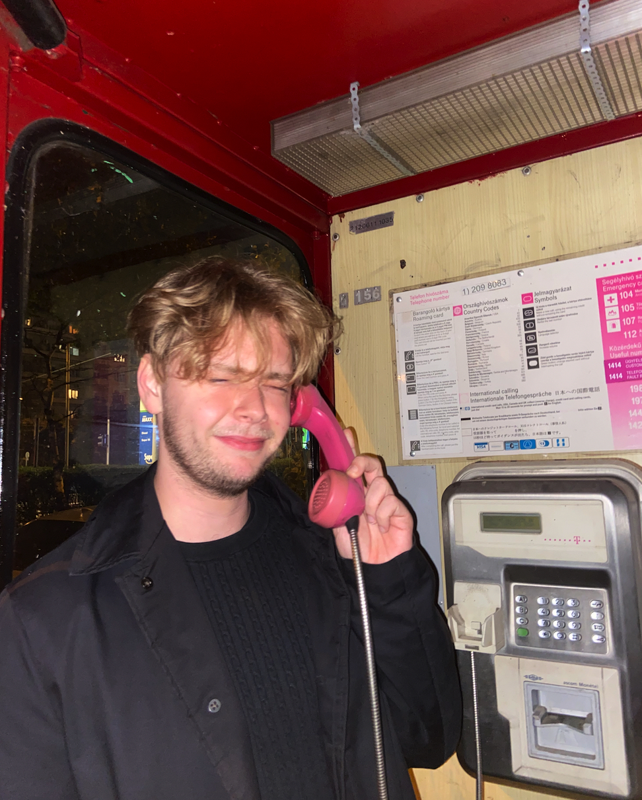
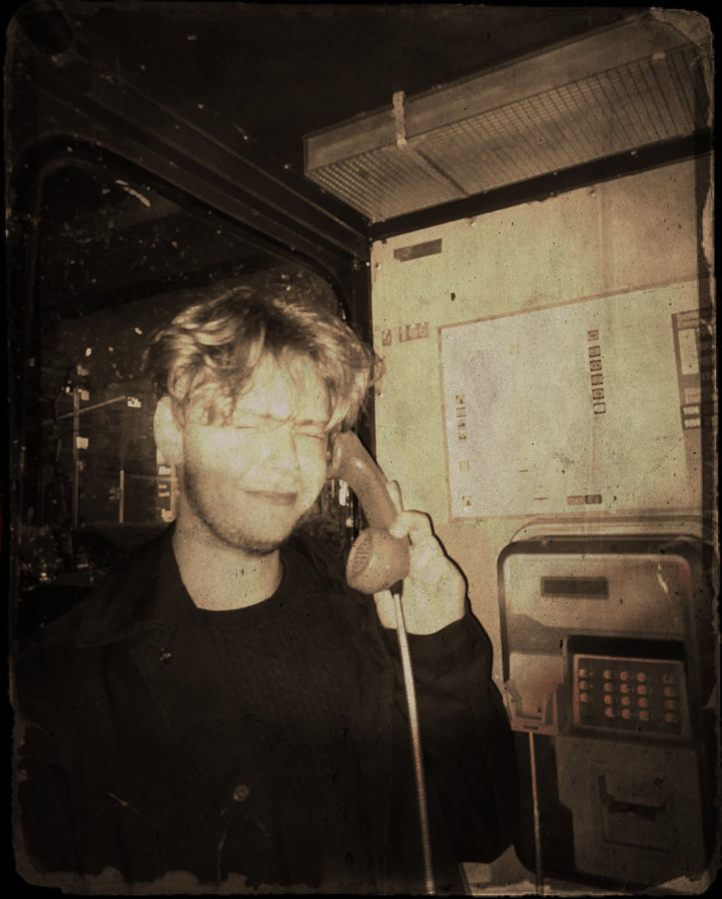

# Retro filter

Optional homework for the subject [Image Processing](https://portal.vik.bme.hu/kepzes/targyak/VIIIAD01) at Budapest University of Technology and Economics.

The requirements for the homework were the following:

- Image color transformation [X]
    - This is completed with a sepia filter
- Add vignette effect [X] 
    - Completed with a vignette effect
- Low contrast [X] 
    - Done with contrast change
- Noises and patches [X] 
    - Created with salt and pepper noise, gaussian blur and dilation
- Add retro border [X] - with border

The original picture was this:

and here's the modified one:
